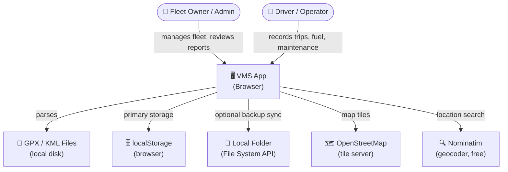
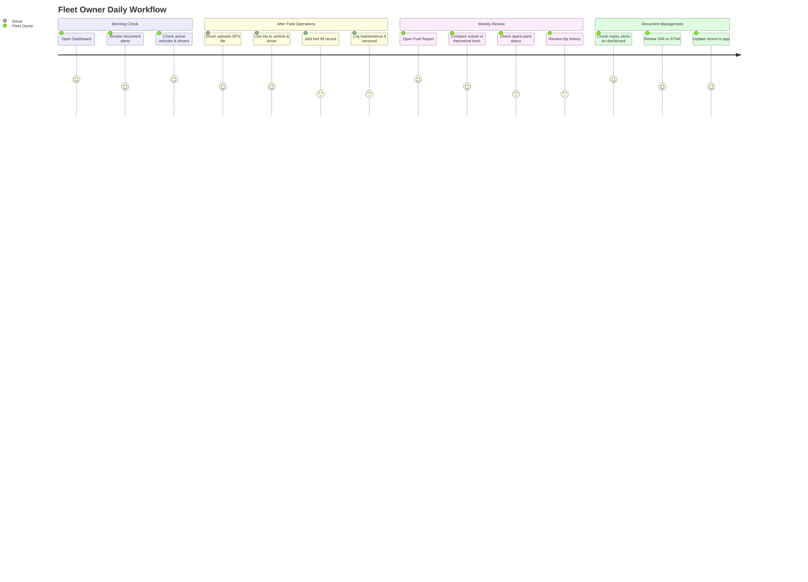
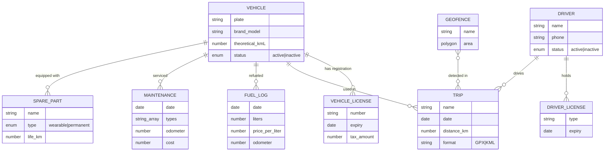
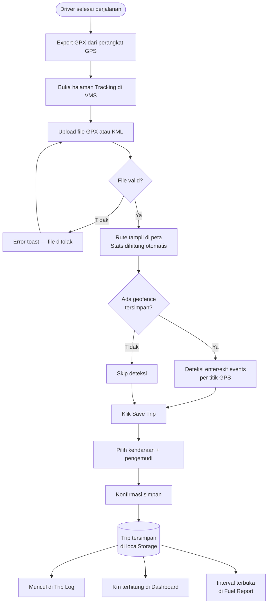
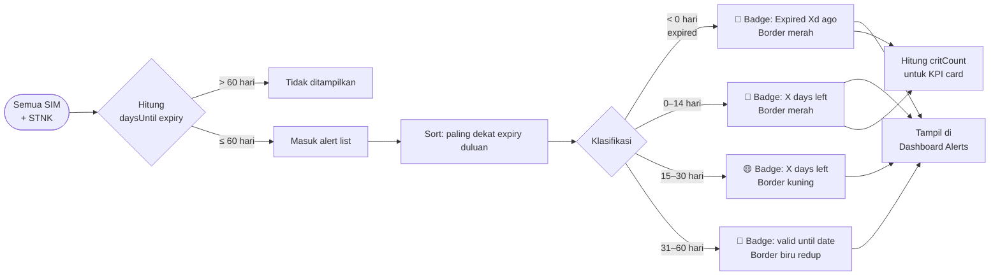
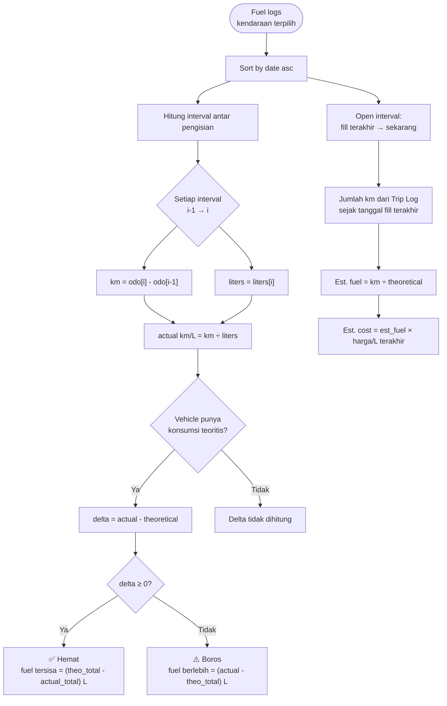
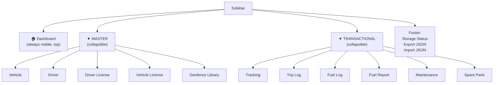

# PRD — Vehicle Monitoring System (VMS)

**Version:** 1.1  
**Date:** 2026-07-05  
**Status:** Active  

---

## 1. Overview

VMS adalah aplikasi manajemen armada kendaraan berbasis browser. Dibangun sebagai zero-dependency single-page application yang berjalan langsung dari file lokal atau local server — tanpa backend, tanpa cloud, tanpa biaya infrastruktur.

Target utama: pemilik armada kecil (3–30 kendaraan) yang ingin mencatat perjalanan, konsumsi BBM, perawatan, dan kelengkapan dokumen secara terpusat di satu tempat.

---

## 2. User Personas

### Persona A — Fleet Owner / Admin
- Memiliki 5–20 kendaraan (motor/mobil operasional)
- Tidak punya IT background; terbiasa pakai spreadsheet
- Butuh ringkasan cepat: mana kendaraan aktif, dokumen mau expired, bensin bulan ini berapa
- Akses dari desktop/laptop, Chrome atau Edge

### Persona B — Driver / Operator
- Mengoperasikan 1–3 kendaraan
- Menginput data setelah perjalanan: upload GPX, isi log BBM, catat servis
- Tidak perlu akses ke semua fitur — cukup Tracking, Fuel Log, Maintenance

---

## 3. Goals & Non-Goals

### Goals
- Rekam perjalanan dari file GPX/KML dan simpan ke database lokal
- Kelola master data: kendaraan, pengemudi, lisensi, dokumen
- Pantau konsumsi BBM aktual vs teoritis
- Alert dokumen kedaluwarsa (SIM, STNK)
- Kelola jadwal perawatan dan stok suku cadang
- Export/import seluruh data sebagai JSON backup
- Visualisasi ringkas di dashboard (chart, infografis)
- Cari lokasi di peta tanpa API key berbayar

### Non-Goals
- Real-time GPS tracking (tidak ada hardware integration)
- Multi-user / role-based access
- Cloud sync / remote backup
- Mobile app (browser-only, Chrome/Edge desktop)
- Reporting ke pihak ketiga (insurance, regulator)

---

## 4. Features

### 4.1 Dashboard
- Greeting header dengan tanggal hari ini
- 4 KPI cards: Active Vehicles, Active Drivers, Needs Attention (docs + maintenance overdue), Total Trips
- Trip Activity chart: area chart dengan smooth bezier curve, 14 hari terakhir, km/hari
- Fuel Cost Trend chart: area chart 8 pengisian terakhir, Rp per pengisian
- Fleet Status panel: donut rings SVG untuk vehicle + driver (aktif/total) + total jarak + jumlah pengisian
- **Maintenance Due alerts**: record dengan `nextDueDate` dalam 14 hari atau `nextDueKm` dalam 500 km — badge Overdue/Upcoming, link ke Maintenance page
- Document Alerts: list SIM/STNK yang expired atau akan expired dalam 60 hari
- Recent Trips: 5 trip terakhir dengan riding score, klik untuk buka di Tracking

### 4.2 Tracking
- Upload GPX atau KML file
- Visualisasi rute 3 mode: **Speed** (default, color gradient merah→hijau), **Gear** (per-gear color), **Harshness** (acceleration harshness overlay)
- Satellite / Street map toggle — ESRI World Imagery tiles (gratis, no API key) + OpenStreetMap, via `L.control.layers()`
- Stats panel: jarak, kecepatan maks/rata-rata, elevasi gain/loss, durasi
- Playback slider dengan animasi marker posisi; playback label menampilkan speed + estimated gear
- Geofence event detection (enter/exit berdasarkan ray-casting)
- Simpan trip: modal link ke vehicle + driver, simpan ke `vms_trips`; riding analysis dicompute saat save
- Search lokasi di peta (Nominatim geocoder, gratis, no API key)
- State persistence: saat kembali ke halaman Tracking, trip terakhir tetap tampil (`_lastViewedTripId`)

### 4.3 Trip Log
- Tabel semua trip tersimpan dengan filter per kendaraan
- Kolom: Date, Trip Name, Vehicle, Driver, Distance, Format (GPX/KML), **Riding** (score badge)
- Auto-compute riding analysis untuk trip lama (sebelum fitur ada): compute on-the-fly lalu cache ke localStorage
- Klik eye icon → buka trip di Tracking

### 4.4 Fuel Log
- Rekam setiap pengisian BBM: kendaraan, tanggal, waktu, liter, harga/L, odometer, SPBU
- KPI summary: total pengisian, total liter, total biaya
- Edit dan hapus entri

### 4.5 Fuel Report
- Pilih kendaraan dan periode (per interval pengisian, atau semua)
- KPI: Actual Avg km/L, Theoretical (Spec), Efficiency Delta, Total Distance, Saved/Over (L dan Rp)
- Bar chart SVG: km/L per interval, garis teoritis, color-coded (hijau = efisien, kuning = boros)
- Open interval: estimasi BBM dan biaya berdasarkan trip sejak pengisian terakhir

### 4.6 Maintenance Log
- Catat servis: kendaraan, tanggal, jenis (multi-type checkbox), odometer, biaya, bengkel, notes
- Auto-suggest next due date + km berdasarkan interval standar per jenis servis
- Status badge per record: upcoming / overdue

### 4.7 Spare Parts
- Inventory suku cadang dengan lifetime tracking
- Dua tipe: wearable (ada KM/hari lifespan) dan permanent
- Status badge: OK / Soon / Replace! berdasarkan sisa km atau hari
- Auto-suggest interval penggantian berdasarkan daftar part standar

### 4.8 Master Data

**Vehicle**
- Plat nomor, merek, model, tahun, CC, konsumsi teoritis (km/L), status (active/inactive)
- Estimasi odometer dari fuel log

**Driver**
- Nama, telepon, tanggal lahir, status
- Linked ke Driver License

**Driver License (SIM)**
- Tipe SIM, nomor, tanggal berlaku, linked ke driver
- Badge: valid (hijau) / expiring soon (kuning) / expired (merah)

**Vehicle License (STNK)**
- Nomor STNK, nama terdaftar, masa berlaku, pajak tahunan, linked ke vehicle
- Badge sama seperti SIM

**Geofence Library**
- Buat dan simpan area geofence (polygon) di peta
- Draw mode interaktif di Leaflet
- Digunakan di Tracking untuk deteksi enter/exit event
- Search lokasi di peta (Nominatim)

### 4.11 Riding Analysis

> Hanya tersedia untuk kendaraan yang memiliki konfigurasi gear (min/max km/h per gear).

**Gear Configuration (per vehicle):** user input rentang kecepatan per gear (mis. Gear 1: 0–20 km/h, Gear 2: 15–35 km/h) di Vehicle form.

**Gear Estimation Algorithm:**
- 3-point moving average pada GPS speed per titik
- Hysteresis: prefer gear sebelumnya jika masih valid (mengurangi gear hunting)
- Titik stasioner (speed < 2 km/h) → gear 0 (neutral/stop)

**Harshness Classification** (acceleration km/h/s):
- Smooth: |accel| < 1.5
- Moderate: 1.5 ≤ |accel| < 3.0
- Harsh: |accel| ≥ 3.0

**Riding Score (0–100):**
```
score = (optimalGearPct × 0.4 + smoothPct × 0.4 + gearEfficiency × 0.2) × 100
```
- `optimalGearPct`: % titik di gear optimal (sesuai kecepatan)
- `smoothPct`: % titik dengan akselerasi smooth
- `gearEfficiency`: 1 − (revHangKm + luggingKm) / totalKm

**Score Labels:**
- ≥ 85: Excellent (green)
- ≥ 70: Good (lime)
- ≥ 55: Fair (orange)
- < 55: Poor (red)

**Riding Analysis Panel (di Tracking):**
- Score ring (SVG donut) + label + gear distribution bar chart
- Smoothness badges (Smooth / Moderate / Harsh %)
- Rev-hang km + Lugging km counts

**Trip Log badge:** score ditampilkan dengan warna per label; trip tanpa gear config menampilkan "-".

### 4.9 Export / Import
- Export: satu file JSON (`vms-backup-YYYY-MM-DD.json`) berisi semua 9 tabel
- Import: restore dari file JSON tersebut

### 4.10 Storage
- Primary: localStorage (`vms_*` prefix)
- Optional: File System Access API — user pilih folder lokal, data di-sync ke file JSON per tabel
- Dual-write: setiap perubahan tulis ke localStorage DAN file (async)
- Status ditampilkan di sidebar footer

---

## 5. Sidebar Navigation

```
[VMS Logo]

Dashboard            ← selalu di atas, di luar group

▼ MASTER
  Vehicle
  Driver
  Driver License
  Vehicle License
  Geofence Library

▼ TRANSACTIONAL
  Tracking
  Trip Log
  Fuel Log
  Fuel Report
  Maintenance
  Spare Parts

[Storage status]
[Export JSON]
[Import JSON]
```

MASTER dan TRANSACTIONAL bisa di-collapse/expand dengan klik header.

---

## 6. UX Requirements

- Dark theme, warna teks utama `#e8eaf0`, background `#0d0f14`
- Tidak ada emoji, semua icon SVG inline
- Modal untuk semua form add/edit (tidak navigasi ke halaman baru)
- Toast notification untuk semua aksi (save/delete/error), auto-dismiss 3.5 detik
- Responsive table dengan horizontal scroll di layar kecil
- Map: `height: 100vh` minus sidebar, tidak ada scroll
- Semua teks UI dalam Bahasa Inggris

---

## 7. Constraints

- Browser: Chrome atau Edge (File System Access API + Leaflet)
- No build step — buka langsung dengan `npx serve .` atau `python -m http.server 8080`
- No external API key — semua layanan gratis (Leaflet OSM tiles, Nominatim geocoder)
- Tidak bisa jalan di `file://` (CORS + module script restriction)
- Data tersimpan lokal — tidak ada cloud sync

---

## 8. Success Metrics

- User bisa tambah kendaraan baru dan lihat di dashboard dalam < 1 menit
- Upload GPX dan simpan trip < 30 detik
- Dashboard load < 500ms (semua data dari localStorage)
- Tidak ada data loss saat navigate antar halaman
- Alert dokumen muncul di dashboard tanpa action dari user

---

## 9. Diagrams

### 9.1 System Context

Siapa yang terlibat dan apa saja sistem eksternal yang disentuh VMS.



---

### 9.2 User Journey — Fleet Owner



---

### 9.3 Business Entity Map

Relasi antar entitas bisnis di level konseptual.



---

### 9.4 Business Process — Trip Recording

Alur kerja dari perjalanan selesai hingga data masuk ke dashboard.



---

### 9.5 Business Process — Document Alert

Bagaimana sistem menentukan dokumen mana yang ditampilkan di Dashboard Alerts.



---

### 9.6 Business Process — Fuel Report

Bagaimana efisiensi BBM dihitung dan dikategorikan.



---

### 9.7 Sidebar Navigation Structure


