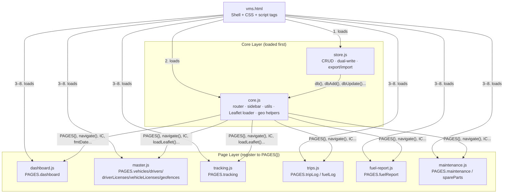
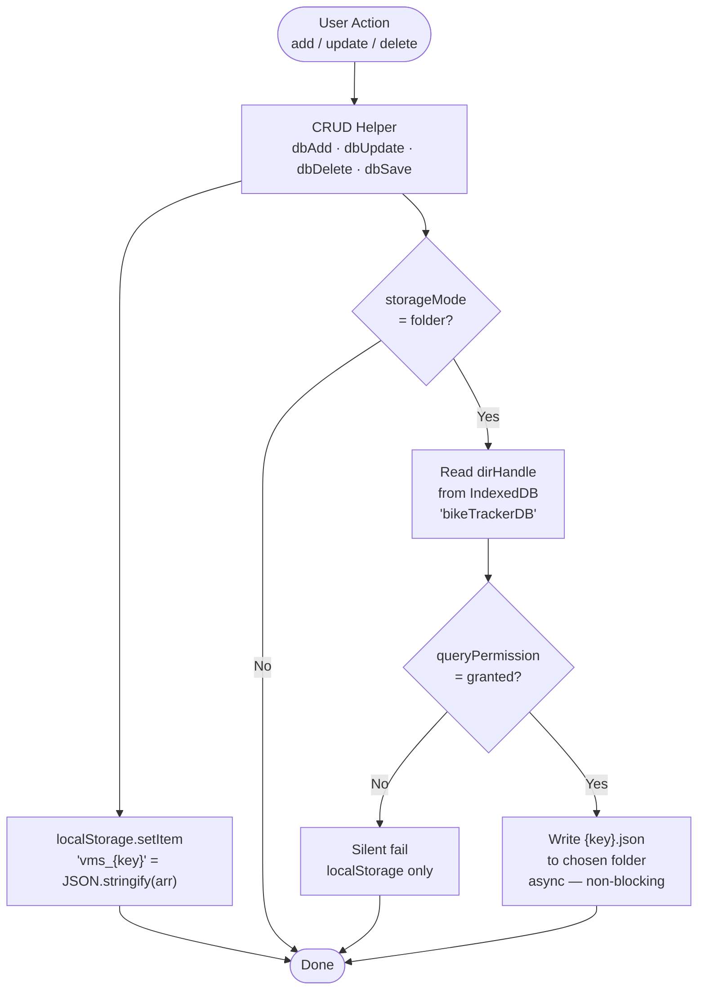
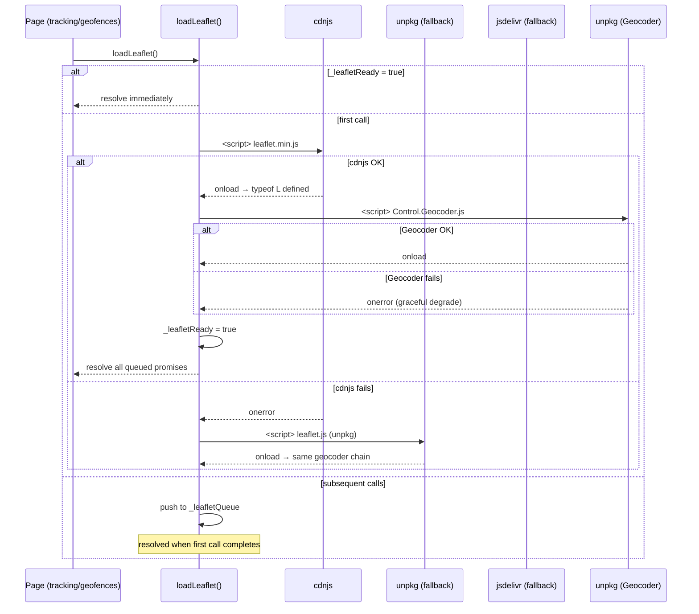
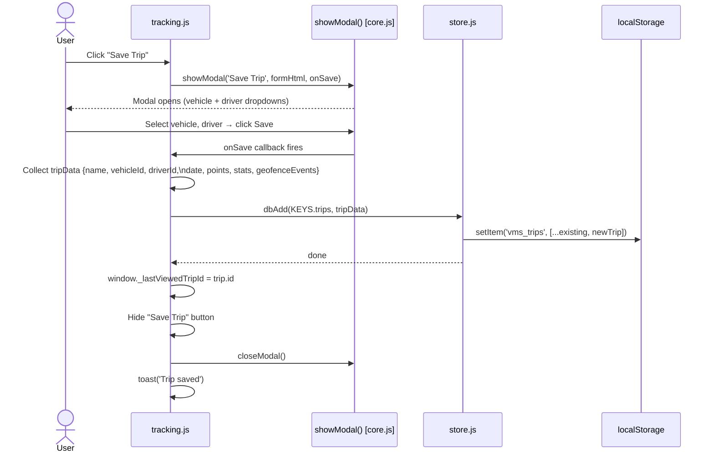
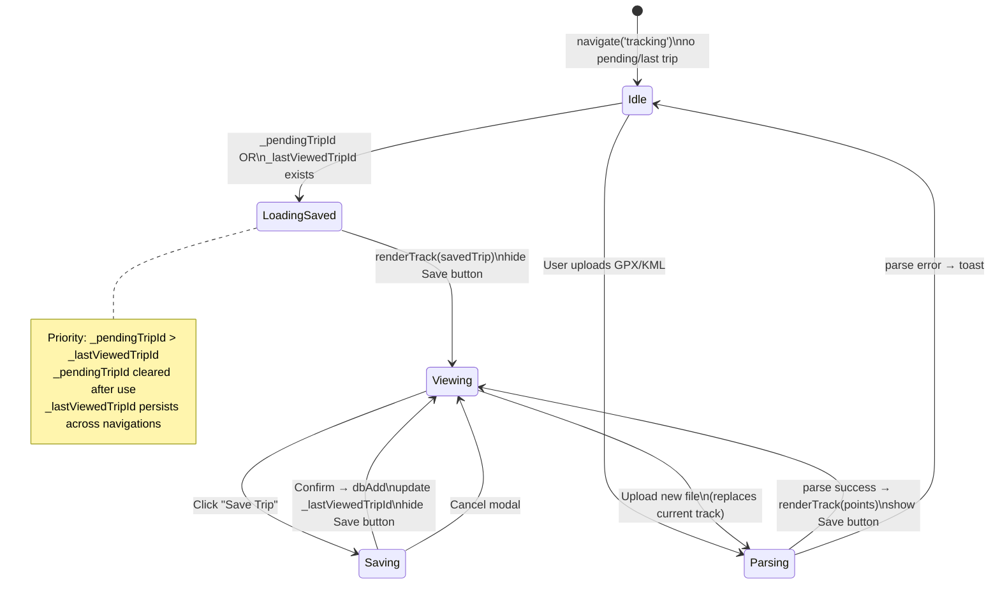
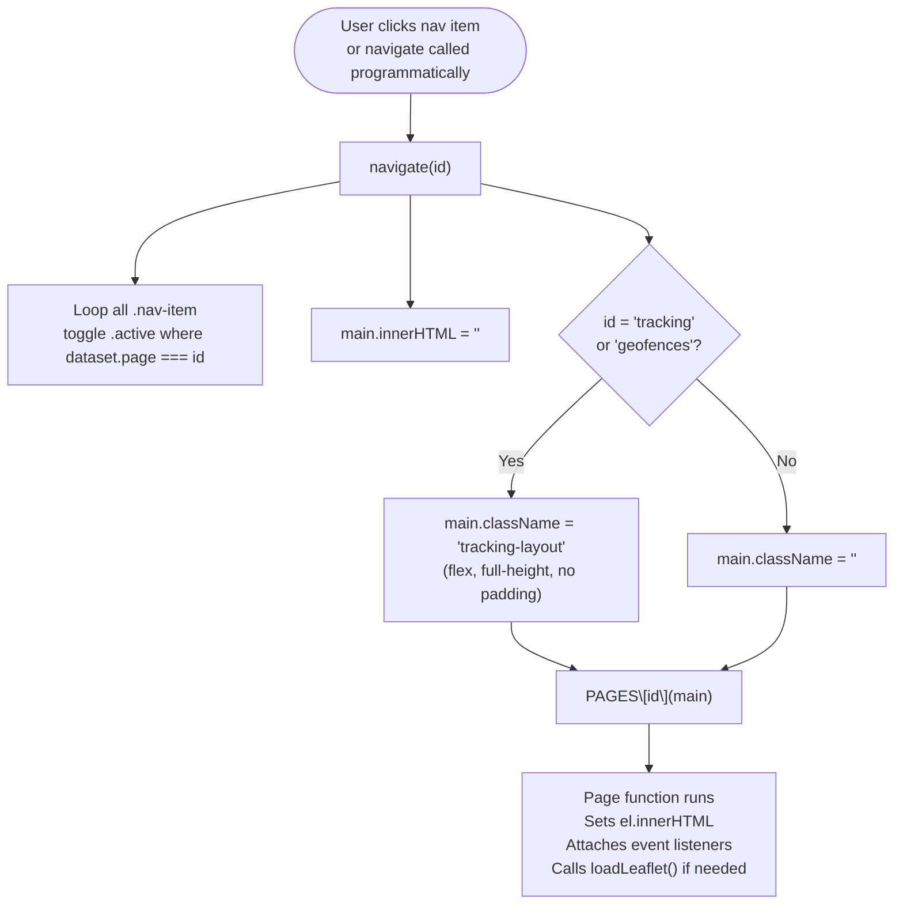
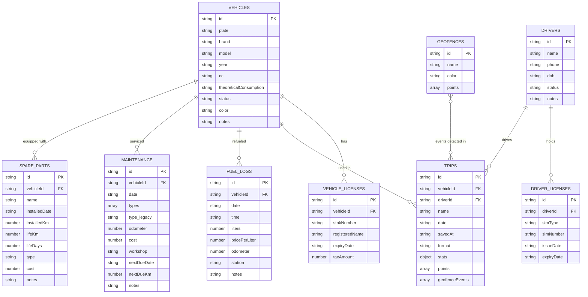
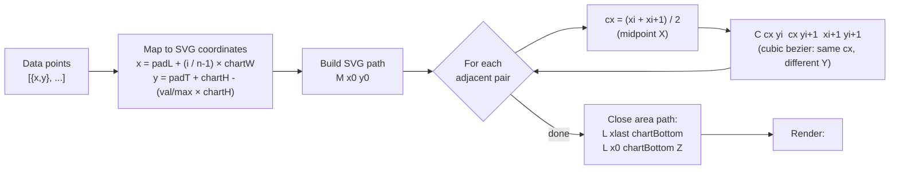

# TSD — Vehicle Monitoring System (VMS)

**Version:** 1.1  
**Date:** 2026-07-05  
**Status:** Active  

---

## 1. Architecture Overview

```
bike-tracker/
├── vms.html                  # App shell: HTML structure, CSS, <script> tags
├── js/
│   ├── store.js              # Data layer: localStorage + File System Access API
│   ├── core.js               # Utils, router, sidebar, Leaflet loader, geo helpers
│   └── pages/
│       ├── dashboard.js      # PAGES.dashboard
│       ├── master.js         # PAGES.vehicles, drivers, driverLicenses, vehicleLicenses, geofences
│       ├── tracking.js       # PAGES.tracking
│       ├── trips.js          # PAGES.tripLog, fuelLog
│       ├── fuel-report.js    # PAGES.fuelReport
│       └── maintenance.js    # PAGES.maintenance, spareParts
```

**Load order** (via `<script>` tags di `vms.html`):
```
store.js → core.js → dashboard.js → master.js → tracking.js → trips.js → fuel-report.js → maintenance.js
```

Page files register dirinya ke `PAGES` object di baris terakhir:
```js
PAGES.dashboard = pageDashboard;
```

---

## 2. Router

```js
// core.js
const PAGES = {};           // populated by page files
let currentPage = 'dashboard';

function navigate(id) {
  currentPage = id;
  document.querySelectorAll('.nav-item').forEach(el =>
    el.classList.toggle('active', el.dataset.page === id)
  );
  const main = document.getElementById('main');
  main.innerHTML = '';
  main.className = (id === 'tracking' || id === 'geofences') ? 'tracking-layout' : '';
  if (PAGES[id]) PAGES[id](main);
}
```

- Setiap navigate: `main.innerHTML = ''` → re-render penuh oleh page function
- Page function menerima `el` (`#main` element) dan mengisi `el.innerHTML`
- Layout khusus tracking: `class="tracking-layout"` (flex, full-height, no scroll)

---

## 3. Data Layer (`js/store.js`)

### 3.1 localStorage Keys

```js
const KEYS = {
  vehicles:        'vms_vehicles',
  drivers:         'vms_drivers',
  driverLicenses:  'vms_driverLicenses',
  vehicleLicenses: 'vms_vehicleLicenses',
  geofences:       'vms_geofences',
  trips:           'vms_trips',
  fuelLogs:        'vms_fuelLogs',
  maintenance:     'vms_maintenance',
  spareParts:      'vms_spareParts',
}
```

### 3.2 CRUD Helpers

| Function | Signature | Description |
|----------|-----------|-------------|
| `db(key)` | `(string) → array` | Read all records for a key |
| `dbSave(key, arr)` | `(string, array) → void` | Overwrite entire array, trigger file sync |
| `dbGet(key, id)` | `(string, string) → object\|null` | Find record by `id` |
| `dbAdd(key, record)` | `(string, object) → void` | Add record with auto `uuid()`, trigger file sync |
| `dbUpdate(key, id, updates)` | `(string, string, object) → void` | Merge updates into record, trigger file sync |
| `dbDelete(key, id)` | `(string, string) → void` | Remove record by id, trigger file sync |

### 3.3 File System Access API (Dual-Write)

```
IDB key: 'dirHandle'  (bikeTrackerDB, store: handles)
```

- Startup: `queryPermission({mode:'readwrite'})` — tidak ada prompt, hanya check
- User action (pickFolder): `showDirectoryPicker()` → simpan handle ke IDB → `requestPermission`
- Write: setiap `dbSave()` panggil `syncToFile(key, data)` async (tidak block UI)
- File per key: `{key_name}.json` di folder yang dipilih user
- `storageMode()`: return `'folder'` jika dirHandle aktif, `'local'` jika tidak

### 3.4 Export / Import

```js
exportData()  // download semua KEYS ke vms-backup-YYYY-MM-DD.json
importData()  // file picker, parse JSON, dbSave per key, toast result
```

---

## 4. Core Utilities (`js/core.js`)

### 4.1 Formatters

```js
const esc     = s => /* textContent → innerHTML encode */
const fmt     = (n, d=1) => Number(n||0).toFixed(d)
const fmtNum  = n => Number(n||0).toLocaleString('en-US')
const fmtCur  = n => 'Rp ' + Number(n||0).toLocaleString('en-US')
const fmtDate = iso => /* en-GB: "05 Jul 2026" */
```

### 4.2 Date Helpers

```js
daysUntil(dateStr)   // → integer (negative = past)
expiryBadge(dateStr) // → HTML badge string
```

### 4.3 Modal System

```js
let _modalSave = null;
showModal(title, bodyHtml, onSave, saveLabel='Save')
closeModal()
// Modal save button di-wire di init(): document.getElementById('modal-save-btn').addEventListener('click', () => _modalSave?.())
```

### 4.4 Toast

```js
toast(msg, type='success')  // types: success | error | info
// auto-remove setelah 3500ms
```

### 4.5 Icons

```js
const IC = {
  vehicle, driver, idcard, document, mappin, grid, map,
  route, droplet, chart, wrench, package, plus, download,
  upload, edit, trash, eye, folder, hdd
}
```

---

## 5. Sidebar & Navigation (`js/core.js`)

### 5.1 NAV Structure

```js
const NAV = [
  { id: 'dashboard', label: 'Dashboard', icon: 'grid' },  // standalone, di luar group
  { section: 'MASTER', key: 'master', items: [...] },
  { section: 'TRANSACTIONAL', key: 'txn', items: [...] },
];
```

### 5.2 Collapsible Groups

```js
const _navCollapsed = { master: false, txn: false };

function _toggleNavGroup(key)
// Toggle maxHeight: '0' ↔ '1000px' + rotate chevron SVG
// DOM: nav-grp-{key} (body div), body.previousElementSibling (header div)
```

### 5.3 buildSidebar()

- Dipanggil sekali di `init()`
- Brand header → Dashboard nav-item → MASTER group → TRANSACTIONAL group → footer
- Footer: storage status, Pick Folder button, Export, Import

### 5.4 Active State

`navigate()` loop `.nav-item[data-page]` dan toggle `.active` class berdasarkan `el.dataset.page === id`. Bekerja untuk item di dalam group body maupun standalone.

---

## 6. Leaflet Loader (`js/core.js`)

```js
let _leafletReady = false;
let _leafletQueue = [];

function loadLeaflet() → Promise
```

**Load sequence:**
1. Try cdnjs → unpkg → jsdelivr (Leaflet 1.9.4)
2. Setelah Leaflet loaded: load `leaflet-control-geocoder` dari unpkg
3. Geocoder onload/onerror → resolve semua queued promises (graceful degrade)
4. Subsequent calls return immediately if `_leafletReady`

---

## 7. Geo Helpers (`js/core.js`)

```js
haversine(a, b)              // {lat,lon} → km (great-circle distance)
getSpeedColor(speed)         // km/h → hex color (red/orange/yellow/lime/green)
buildSpeedTrack(points)      // → Leaflet layer (polyline atau featureGroup)
computeStats(points)         // → {distanceKm, maxSpeed, avgSpeed, elevGain, elevLoss, duration}
parseGPX(xmlText)            // → {points, name, format:'GPX'}
parseKML(xmlText)            // → {points, name, format:'KML'}
pointInPolygon(point, poly)  // ray-casting, → boolean
```

**Track points schema:**
```js
{ lat: number, lon: number, ele: number, time: string|null, speed: number }
// speed: km/h (converted from m/s di parseGPX)
// time: ISO string atau null (KML tidak punya time)
```

---

## 7b. Riding Analysis Functions (`js/core.js`)

### `enrichPoints(points, gearConfig)`

Adds gear + harshness annotation to each track point.

```js
// Step 1: 3-point moving average on speed
// Step 2: gear estimation with hysteresis (prefer prevGear if valid)
//   - speed < 2 km/h → gear 0 (neutral/stop)
//   - candidates = gearConfig entries where minKmh <= smoothedSpeed <= maxKmh
//   - if prevGear in candidates → keep prevGear (hysteresis)
//   - else pick first candidate
// Step 3: acceleration (km/h/s)
//   accel = (speed[i] - speed[i-1]) / timeDeltaSeconds
// Step 4: harshness classification
//   'smooth'   → |accel| < 1.5
//   'moderate' → 1.5 ≤ |accel| < 3.0
//   'harsh'    → |accel| ≥ 3.0
```

Returns: `enrichedPoint[]` — original fields + `{ estimatedGear, smoothedSpeed, accel, harshness }`

### `computeRidingAnalysis(enriched, gearConfig)`

```js
// Metrics accumulated per segment:
// - dist per gear (haversine between consecutive points)
// - harshness buckets (smooth / moderate / harsh dist)
// - rev-hang km: gear lower than optimal for current speed (gear too low → high RPM)
// - lugging km: gear higher than optimal for current speed (gear too high → lugging)

// Score formula:
const optimalGearPct = 1 - (revHangKm + luggingKm) / totalKm;
const smoothPct      = smoothKm / totalKm;
const gearEfficiency = 1 - (revHangKm + luggingKm) / totalKm;
const score = Math.round((optimalGearPct * 0.4 + smoothPct * 0.4 + gearEfficiency * 0.2) * 100);
```

### `buildGearTrack(points)` / `buildHarshnessTrack(points)`

Both return a Leaflet `featureGroup` of colored polyline segments.

```js
// GEAR_COLORS = ['#7b8099','#a78bfa','#4f7af8','#22c55e','#f59e0b','#f97316','#ef4444']
// getGearColor(gear)     → GEAR_COLORS[gear] (0 = neutral gray)
// getHarshnessColor('smooth') → '#22c55e', 'moderate' → '#f59e0b', 'harsh' → '#ef4444'
```

Segmenting: iterate points, emit new polyline segment whenever color changes.

---

## 8. Data Schemas

### Vehicle
```js
{
  id: string,          // uuid
  plate: string,
  brand: string,
  model: string,
  year: string,
  cc: string,
  theoreticalConsumption: string,  // km/L
  status: 'active' | 'inactive',
  color: string,
  notes: string,
  gearConfig: [{ gear: number, minKmh: number, maxKmh: number }] | undefined,
}
```

### Driver
```js
{
  id: string,
  name: string,
  phone: string,
  dob: string,         // YYYY-MM-DD
  status: 'active' | 'inactive',
  notes: string,
}
```

### Driver License (SIM)
```js
{
  id: string,
  driverId: string,
  simType: string,     // A, B1, B2, C, D
  simNumber: string,
  issueDate: string,   // YYYY-MM-DD
  expiryDate: string,
}
```

### Vehicle License (STNK)
```js
{
  id: string,
  vehicleId: string,
  stnkNumber: string,
  registeredName: string,
  expiryDate: string,
  taxAmount: number,
}
```

### Geofence
```js
{
  id: string,
  name: string,
  color: string,       // hex
  points: [[lat, lon], ...],  // polygon vertices
}
```

### Trip
```js
{
  id: string,
  name: string,
  vehicleId: string,
  driverId: string,
  date: string,        // YYYY-MM-DD (date of trip, user-entered)
  savedAt: string,     // ISO timestamp (auto, when saved)
  format: 'GPX' | 'KML',
  stats: {
    distanceKm: number,
    maxSpeed: number,
    avgSpeed: number,
    elevGain: number,
    elevLoss: number,
    duration: string,  // "MM:SS"
  },
  points: [{ lat, lon, ele, time, speed }],
  geofenceEvents: [{ geofenceId, name, type:'Enter'|'Exit', pointIndex }],
  ridingAnalysis: {
    hasGearData: boolean,
    totalKm: number,
    smoothPct: number,
    moderatePct: number,
    harshPct: number,
    gearDist: { [gear: number]: number },  // km per gear
    revHangKm: number,
    luggingKm: number,
    score: number,         // 0–100
    scoreLabel: string,    // 'Excellent' | 'Good' | 'Fair' | 'Poor'
    scoreColor: string,    // hex
  } | undefined,
}
```

### Fuel Log
```js
{
  id: string,
  vehicleId: string,
  date: string,          // YYYY-MM-DD
  time: string|null,     // "HH:MM"
  liters: number|null,
  pricePerLiter: number|null,
  odometer: number|null,
  station: string,
  notes: string,
}
```

### Maintenance Log
```js
{
  id: string,
  vehicleId: string,
  date: string,          // YYYY-MM-DD
  types: string[],       // array of type strings (e.g. ['Oil Change', 'Air Filter'])
  type: string,          // LEGACY field — string only (backward compat)
  odometer: number|null,
  cost: number|null,
  workshop: string,
  nextDueDate: string,
  nextDueKm: number|null,
  notes: string,
}
```

### Spare Part
```js
{
  id: string,
  vehicleId: string,
  name: string,
  installedDate: string,   // YYYY-MM-DD
  installedKm: number|null,
  lifeKm: number|null,
  lifeDays: number|null,
  type: 'wearable' | 'permanent',
  cost: number|null,
  notes: string,
}
```

---

## 9. Page Implementations

### 9.1 Dashboard (`dashboard.js`)

**Data computed:**
- `activeVehicles`, `activeDrivers`: filter by `status === 'active'`
- `critCount`: docs dengan `daysUntil(expiry) <= 30`
- `allDocs`: merge driverLicenses + vehicleLicenses, filter `daysUntil <= 60`, sort ascending
- `recentTrips`: sort by `savedAt` desc, slice 5
- `activityData`: last 14 days, `kmByDay[dateKey]` = sum trips distance per day
- `fuelTrend`: last 8 fuel logs with price, sorted by date
- `maintAlerts`: maintenance records dengan `nextDueDate` dalam 14 hari ATAU `nextDueKm − estOdo ≤ 500`

**Maintenance due computation:**
```js
db(KEYS.maintenance).forEach(m => {
  const estOdo = Math.max(...fuelLogs.filter(l => l.vehicleId === m.vehicleId && l.odometer != null).map(l => Number(l.odometer)));
  if (m.nextDueDate) {
    const d = daysUntil(m.nextDueDate);
    if (d !== null && d <= 14) maintAlerts.push({ ..., daysLeft: d, overdue: d < 0 });
  }
  if (m.nextDueKm && estOdo) {
    const kmLeft = Number(m.nextDueKm) - estOdo;
    if (kmLeft <= 500) maintAlerts.push({ ..., kmLeft: Math.round(kmLeft), overdue: kmLeft <= 0 });
  }
});
```

**KPI 3** = "Needs Attention" → `critCount` (docs) + `maintCritCount` (maintenance overdue), sub shows breakdown.

**Recent trips** show riding score badge if `ra?.hasGearData`.

**SVG helpers (defined inline):**
- `svgAreaChart(data, valueKey, W, H, color, gradId, labelKey)` — smooth cubic bezier area chart
- `svgDonut(val, total, color, size)` — SVG stroke-dasharray donut ring

**Bezier smoothing algorithm:**
```js
// Control points: midpoint X, same Y as adjacent points
const cx = (pts[i].x + pts[i+1].x) / 2;
`C ${cx} ${pts[i].y} ${cx} ${pts[i+1].y} ${pts[i+1].x} ${pts[i+1].y}`
```

### 9.2 Tracking (`tracking.js`)

**State:**
```js
window._pendingTripId     // set by Trip Log "View" → cleared after load
window._lastViewedTripId  // persists across navigations (set when viewing saved trip)
let tEnriched = []        // enriched points for current track (gear + harshness)
let tTrackMode = 'speed'  // 'speed' | 'gear' | 'harshness'
```

**Load priority:**
```js
const tripIdToLoad = window._pendingTripId || window._lastViewedTripId;
window._pendingTripId = null;  // clear pending, keep lastViewed
```

**Map:** `loadLeaflet()` → create `tMap` → Street + Satellite layers → `L.control.layers()` switcher → geocoder → `buildSpeedTrack()`

**Satellite tile:**
```js
const _satL = L.tileLayer('https://server.arcgisonline.com/ArcGIS/rest/services/World_Imagery/MapServer/tile/{z}/{y}/{x}', { attribution: 'Esri', maxZoom: 19 });
L.control.layers({ 'Street': _streetL, 'Satellite': _satL }, {}, { position: 'topright' }).addTo(tMap);
```

**3-mode track rendering:**
- `window.setTrackMode(mode)` — updates `tTrackMode`, calls appropriate builder, re-renders legend
- `renderModeLegend(mode)` — updates speed swatches in legend panel

**Save trip flow:**
1. `showModal('Save Trip', ...)` — user isi vehicle + driver
2. Compute `ridingAnalysis = computeRidingAnalysis(enrichPoints(points, veh.gearConfig), veh.gearConfig)` if gearConfig available
3. `dbAdd(KEYS.trips, { ...stats, points, geofenceEvents, ridingAnalysis })`
4. `window._lastViewedTripId = saved[saved.length - 1]?.id`

**Geocoder:**
```js
if (L.Control.Geocoder) {
  L.Control.geocoder({ defaultMarkGeocode: false, geocoder: L.Control.Geocoder.nominatim() })
    .on('markgeocode', e => tMap.fitBounds(e.geocode.bbox))
    .addTo(tMap);
}
```

### 9.3 Master (`master.js`)

**5 page functions:** `pageVehicles`, `pageDrivers`, `pageDriverLicenses`, `pageVehicleLicenses`, `pageGeofences`

**Geofence draw mode:**
- `drawing` boolean flag
- `map.on('click')` → push vertex
- `map.on('dblclick')` → close polygon, save
- Preview polygon redrawn on each click

**Geocoder on geofences map:** sama dengan tracking

**`estOdometer(vehicleId)`:**
```js
const logs = db(KEYS.fuelLogs).filter(l => l.vehicleId === vehicleId && l.odometer != null);
return logs.length ? Math.max(...logs.map(l => Number(l.odometer))) : null;
```

### 9.4 Fuel Report (`fuel-report.js`)

**Interval computation:**
```js
for (let i = 1; i < logs.length; i++) {
  const km  = logs[i].odometer - logs[i-1].odometer;
  const lit = logs[i].liters;
  // actual km/L = km / lit
}
```

**Open interval** (last fuel log → now):
```js
const tripsAfter = db(KEYS.trips)
  .filter(t => t.vehicleId === vehicleId && (t.date || '') >= lastDate);
// String comparison — intentional, trip tidak punya time field
```

**Chart:** SVG dengan `<rect>` per interval, `<line>` untuk theoretical target

### 9.5 Maintenance (`maintenance.js`)

**TYPES array:** `['Oil Change', 'Oil Filter', 'Air Filter', 'Spark Plug', 'Tune Up', ...]`  
**SVC object:** keys = TYPES values, values = `{days, km}` — **harus selalu sinkron**

**Auto-suggest (`window.maintAutoSuggest()`):**
```js
// Panggil setelah user pilih jenis servis
// Ambil SVC[type] → suggest nextDueDate + nextDueKm ke form field
```

**SUGGESTIONS, PART_KM, PART_DAYS:** keys spare parts = English names, **harus sinkron** dengan TYPES yang relevan

---

## 10. CSS Architecture (`vms.html`)

Semua CSS ada di satu `<style>` block di `vms.html`. Struktur:

| Section | Classes |
|---------|---------|
| Layout | `#app`, `#sidebar`, `#main`, `.tracking-layout`, `.tracking-panel` |
| Navigation | `.brand`, `.nav-item`, `.nav-group-hd`, `.nav-chevron`, `.nav-group-body` |
| Page | `.page`, `.page-header`, `.page-title`, `.page-sub` |
| Buttons | `.btn`, `.btn-primary`, `.btn-secondary`, `.btn-danger`, `.btn-ghost`, `.btn-sm` |
| Tables | `.table-wrap`, `table`, `thead`, `td`, `.td-actions` |
| Badges | `.badge`, `.badge-success`, `.badge-warning`, `.badge-danger`, `.badge-muted`, `.badge-accent` |
| Forms | `.form-grid`, `.form-grid-2`, `.form-grid-3`, `.form-group`, `input`, `select`, `textarea` |
| Cards | `.card`, `.kpi-grid`, `.kpi-card`, `.kpi-label`, `.kpi-value`, `.kpi-sub` |
| Sections | `.section-title`, `.section-gap`, `.alert-list`, `.alert-item` |
| Modal | `#modal-backdrop`, `#modal-box`, `#modal-header`, `#modal-body`, `#modal-footer` |
| Toast | `#toast-container`, `.toast`, `.toast-success`, `.toast-error`, `.toast-info` |
| Chart | `.chart-wrap`, `.chart-legend`, `.legend-item`, `.legend-dot` |
| Misc | `.empty-state`, `.upload-box`, `.info-box`, `.color-dot`, `.divider` |

**Design tokens:**
```css
:root {
  --bg:      #0d0f14;   /* body background */
  --surface: #111318;   /* sidebar */
  --card:    #1a1d24;   /* content cards */
  --border:  #252830;   /* dividers */
  --accent:  #4f7af8;   /* primary / active */
  --accent-h:#3d68e6;   /* accent hover */
  --danger:  #ef4444;
  --warning: #f59e0b;
  --success: #22c55e;
  --text:    #e8eaf0;
  --muted:   #7b8099;
  --subtle:  #3a3e50;
}
```

---

## 11. Known Constraints & Edge Cases

| Constraint | Detail |
|------------|--------|
| `file://` tidak bisa | File System Access API + module CORS butuh `http://` |
| `showDirectoryPicker()` butuh user gesture | Tidak bisa dipanggil di `init()`, hanya di button click handler |
| KML tidak punya time/speed | `time: null`, `speed: 0` per point — beberapa stat tidak tersedia |
| Maintenance backward compat | Record lama punya `m.type` (string), baru punya `m.types` (array). Display cek `Array.isArray(m.types)` |
| Trip date vs savedAt | `date` = tanggal perjalanan (user input, YYYY-MM-DD), `savedAt` = ISO timestamp saat save. Fuel Report pakai `date`, Trip Log sort pakai `savedAt` |
| Geocoder CDN fail | `gc.onerror = resolve` — app tetap jalan tanpa search HUD |
| localStorage size limit | ~5MB per origin. Trips dengan banyak points bisa besar. Tidak ada kompresi saat ini |

---

## 12. Diagrams

### 12.1 Module Architecture & Dependency Graph



---

### 12.2 Storage Architecture — Dual-Write Flow



---

### 12.3 Leaflet + Geocoder Load Sequence



---

### 12.4 Save Trip Sequence



---

### 12.5 Tracking Page State Machine



---

### 12.6 Router Flow



---

### 12.7 ER Diagram — All 9 Tables (Technical)



---

### 12.8 Dashboard SVG Chart — Bezier Smoothing Algorithm

Visualisasi bagaimana control points dihitung untuk smooth area chart.


